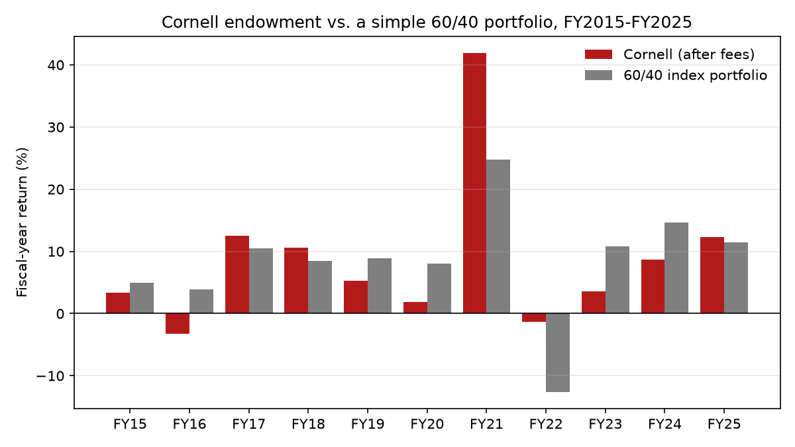

# Endowment Manager Evaluation: Skill or Luck?

**Question:** Do actively managed US equity funds beat the market after fees, and how should an endowment's record be judged against a simple 60/40 portfolio?

**Key result:** After fees, **0 of 3** active funds showed statistically significant alpha (Fama-French 3-factor regression, Jan 2015 – Aug 2026). Cornell's endowment averaged 8.7%/yr vs. 8.5% for a 60/40 over FY2015–FY2025, a gap far below the ~4.8 pts/yr needed to tell skill from luck in 11 years.

| Fund | Return/yr | Fee | Alpha/yr | 95% CI | Verdict |
|---|---|---|---|---|---|
| FCNTX Fidelity Contrafund | 15.9% | 0.74% | +1.7% | −0.8% to +4.2% | can't tell |
| AGTHX Growth Fund of America | 14.2% | 0.59% | +0.3% | −1.8% to +2.3% | can't tell |
| TRBCX T. Rowe Blue Chip Growth | 14.4% | 0.70% | −0.3% | −3.1% to +2.5% | can't tell |
| VFIAX Vanguard 500 Index | 13.9% | 0.04% | – | – | benchmark |

### Part 2: Cornell's endowment vs. a simple 60/40 portfolio (FY2015–FY2025)

| | Cornell | 60/40 index portfolio | Difference |
|---|---|---|---|
| Average yearly return | 8.7% | 8.5% | +0.2 pts |
| Excluding FY2021 (+41.9%) | | | −1.5 pts |
| Gap needed to tell skill from luck (2 × SD ÷ √11) | | | ~4.8 pts/yr |

Over 10 years to June 2025, Cornell's own report shows 8.6%/yr vs. 8.5% for its target portfolio and 8.0% for the peer median. Caveats: Cornell's private investments are valued infrequently (smoothing returns), and 11 years is a short record dominated by one year.

**Read more:** [1-page memo](memo.md) ([PDF](memo.pdf)) · [Excel summary](output/summary.xlsx) · [code](analysis.py)

**Run it:** `pip install pandas matplotlib statsmodels yfinance openpyxl requests`, then `python analysis.py` (downloads the data and rebuilds everything in `output/`).
