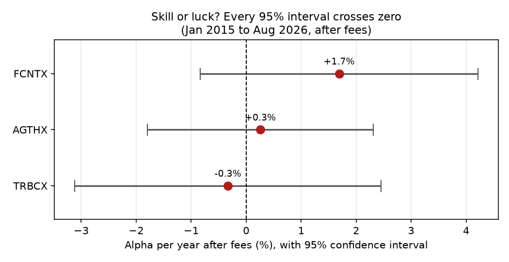

# Memo: Are our active equity managers earning their fees?

**To:** Investment Committee (practice memo) · **From:** Haim · **Date:** October 2, 2026

**Data:** monthly returns Jan 2015 – Aug 2026 (140 months); Cornell fiscal years FY2015–FY2025

## Bottom line
**Keep Fidelity Contrafund on a watch list; replace Growth Fund of America and T. Rowe Price Blue Chip Growth with the Vanguard 500 index fund.** After fees, none of the three managers shows statistically significant skill (0 of 3). Contrafund has the best estimate (+1.7%/yr), while the other two add roughly nothing (+0.3% and −0.3%/yr) at 15–18× the index fund's fee.

## Fund comparison (returns after fees)

| Fund | Return/yr | Volatility | Worst drop | Sharpe | Fee | Alpha/yr | 95% CI | Verdict |
|---|---|---|---|---|---|---|---|---|
| FCNTX Fidelity Contrafund | 15.9% | 16.0% | −30.9% | 0.88 | 0.74% | +1.7% | −0.8% to +4.2% | can't tell |
| AGTHX Growth Fund of America | 14.2% | 16.7% | −33.6% | 0.76 | 0.59% | +0.3% | −1.8% to +2.3% | can't tell |
| TRBCX T. Rowe Blue Chip Growth | 14.4% | 18.1% | −39.8% | 0.73 | 0.70% | −0.3% | −3.1% to +2.5% | can't tell |
| VFIAX Vanguard 500 Index | 13.9% | 15.0% | −23.9% | 0.81 | 0.04% | – | – | benchmark |

Alpha comes from a Fama-French 3-factor regression (market, size, value; R² 0.93–0.96). All three funds lean toward growth stocks (negative value beta), which explains much of their higher raw returns.

## How I'd evaluate Cornell's endowment record
Over FY2015–FY2025, Cornell's long-term investments returned an average of 8.7% a year after fees, versus 8.5% for a simple 60/40 index portfolio (Vanguard total stock and bond market funds). The year-to-year difference is large (standard deviation 7.9 points), so with 11 years the average gap would need to be about 4.8 points a year (2 × SD ÷ √11) before it clearly reflects more than luck; the actual gap is +0.2 points, and −1.5 points without FY2021 (+41.9%). Against peers, Cornell's own report shows 8.6% a year over 10 years, versus 8.5% for its target portfolio and 8.0% for the peer median, ahead over 5 and 10 years and behind over 3 years. Comparisons with a 60/40 are imperfect: Cornell holds private investments that are valued infrequently, which smooths reported returns and can shift gains between fiscal years. Eleven years can show whether a program is roughly competitive, but not whether it has durable skill.

## Limitations
- **Survivorship bias:** the three funds were chosen because they still exist and are well known; funds that did badly and closed are missing, which flatters active managers.
- **Small sample:** only 3 funds and about 11.7 years of data; most alphas cannot be distinguished from zero.
- **Model:** a US-stock-only 3-factor model (no momentum, quality or international factors).
- **Cornell data:** peer medians were collected only for FY2020–FY2025, and one year (FY2021) dominates the record.

## Next steps
I plan to extend this to 20 years of endowment returns and add Cornell's published benchmarks.

*All numbers are produced by `analysis.py`; see `output/summary.xlsx` for the full tables and sources.*
